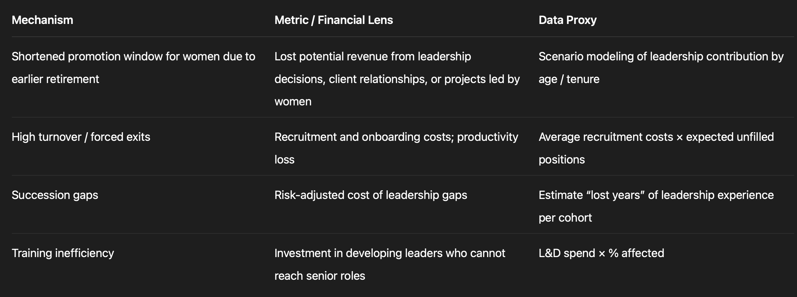

# Core questions 
1. How does retirement age policy function as a structural DEI mechanism influencing gender equity and leadership pipelines?
2. How does gender-differentiated retirement age operate as a structural DEI constraint within organizations?

## Analytical sub-questions
1. Pipeline effect
How does earlier retirement mechanically reduce female representation at senior levels?
2. Investment distortion
How does retirement age asymmetry affect firms’ incentives to invest in female leadership development?
3. Policy leverage
Under what conditions can retirement age reform function as a high-leverage DEI intervention?

# Focus can be 
A structural constraint that shapes organizational outcomes regardless of intent.

# Audience-Centered Framing: Business Leadership
Primary lens:
“How does gender-differentiated retirement age policy affect leadership pipelines, and what are the financial and operational consequences for the organization?”

## Key executive “pain points” you can highlight:
- Talent loss: high-potential women leaving before reaching senior leadership
- Succession gaps: fewer women ready for critical roles
- Hidden costs: recruitment, training, and lost leadership experience
- ROI inefficiencies: underutilized mid- and late-career talent

# Revised Research Question (Business-Finance Focus)

How do gender-differentiated retirement age policies structurally shape leadership pipelines, and what are the financial and operational implications for organizational performance and talent ROI?

## Optional shorter variant for a slide / visual report:

Retirement rules shape pipelines—and profitability: quantifying the hidden cost of gendered exit policies.

# Data Scope
a. Retirement policy data
- Gender-differentiated retirement ages by country / region / industry
- China-specific policies are publicly documented (labor law, government notices)
- Optional OECD / EU comparators

b. Workforce demographics and labor statistics
- Population pyramids by gender and age (World Bank, UN, or China National Bureau of Statistics)
- Labor force participation rates by age/gender
- Gender composition in leadership by sector (if available from annual reports or surveys)

c. Published case studies
- Cummins China example (interview)
- Other public or media-reported examples of retirement age policy changes

d. Scenario / illustrative modeling
- You can simulate a leadership pipeline: define cohorts (e.g., 30–65 years), promotion rates per career stage, and retirement ages.
- Use assumptions from literature or HR research on promotion timing, attrition, etc.

Bottom line: Public data + reasonable, transparent assumptions are enough for a portfolio-ready executive insight piece. You don’t need sensitive internal HR data.