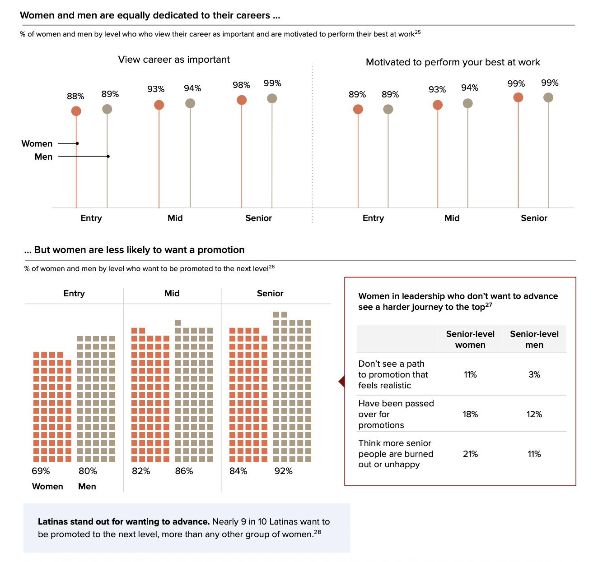
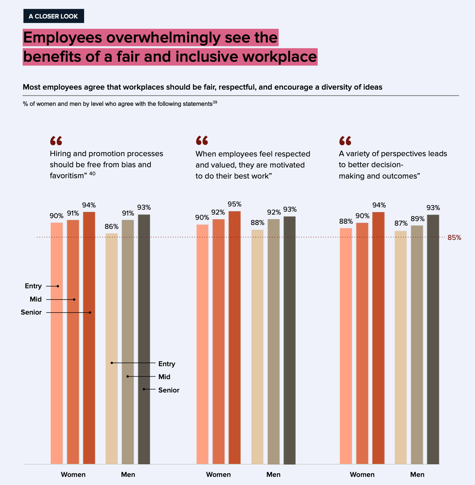

# [Gender differences in retirement decisions and outcomes: a systematic literature review and recommendations for future research](https://academic.oup.com/workar/advance-article/doi/10.1093/workar/waaf011/8313654)

> cite:
Harris, A., & Fasbender, U. (2025). Gender differences in retirement decisions and outcomes: a systematic literature review and recommendations for future research. Work, Aging and Retirement, waaf011.

- women tend to get retired ealier in most situation
- The "Married" and "Poor health" two factors will make women choose retire ealier. Which make me reflect that men and women actually enter workplace at a same age level. but why women has shorter career life? 
- A spouse's higher education level delays retirement for dual-earner women.
- Women who care for a spouse are five times more likely to retire than those who do not provide any care. Men generally retire later when they provide informal care, regardless of whether the care recipient lives in the same household or elsewhere.
- Women leave work earlier than men, even when education or pension eligibility is controlled for. Women also are more likely than men to leave work even if they are not yet eligible to receive a pension.
Further, women with the lowest and with the highest levels of education are more likely to delay retirement than men with the same
- retire aging influenced by tradiional gender roles and economic dependencies
- In Finland, Riekhoff and Järnefelt (2017)reported that marital status had no significant impact on men’s retirement decisions but affected women’s
retirement trajectories; in so far as divorced women were more likely to have long careers and less likely to opt for early retirement, suggesting that marital disruptions have a more profound impact on women’s retirement plans than on men’s.
- In Japan, primary female caregivers are more likely to plan to retire earlier than men. However, in the United States, Stoiko and Strough (2019) note that caregiving roles can prompt early retirement for both men and women, likely due to limited eldercare support in Liberal welfare regimes,
-  Meng (2012) noted that for men, each additional hour of care per week increased men’s likelihood of retiring by 3.3%.
- women’s retirement timing may be shaped more by family responsibilities and spousal income than by health insurance coverage.

However, in the United States,
Stoiko and Strough (2019) note that caregiving roles can
prompt early retirement for both men and women, likely due
to limited eldercare support in Liberal welfare regimes, though
traditional gender norms make women more likely to withdraw
from the workforce (Dentinger & Clarkberg, 2002).
Men typically adjust their retirement timing based on their
spouses’ caregiving needs and their own capacity to provide
care. Studies from Europe and the United States, show that
men tend to retire earlier only when their wives require signif-
icant caregiving due to health issues

# [Gender Differences in Retirement Decision in Hong Kong](https://www.tandfonline.com/doi/abs/10.1300/J074v17n04_05)
> cite:
Lee, W. K. M. (2005). Gender differences in retirement decision in Hong Kong. Journal of Women & Aging, 17(4), 59-76.

- older men were more likely to participate in the labor force than older women.
- older workers, in particular older women, with pension were less likely to retire.
- Having a working spouse decreased the likelihood of retirement and older workers, in particular older women, living with married children were more likely to retire. 
- Poor health also discourages the propensity to continue working at old age.

# [Mathematical model of gender bias and homophily in professional hierarchies](https://doi.org/10.1063/1.5066450)

这篇文章可以解决的问题是，通过数学模型计算衡量一个领域是否有明显的gender domination 倾向，可以就此判断要不要招聘 unconscious bias training mentor，以保证男女有同样的晋升机会。
back to my focus, now I want to find evidence that it is deserve to apply police which Men and Women retire in the same age. 

# [退休年龄问题报告](https://www.ilo.org/sites/default/files/wcmsp5/groups/public/%40asia/%40ro-bangkok/%40ilo-beijing/documents/publication/wcms_166035.pdf?utm_source=chatgpt.com)
2011 年中国就退休年龄问题就有过系统的研究。

文中说到“当妇女权益保障者或妇女组织向相兲决策部门提出男女同龄退休的要求时，一个惯性的回答是‚大部分妇女自己不同意男女同龄退休‛。这种说法在大众传媒的相兲辩论中也屡见不鲜。”

“被访者中平均约有 15.5%的人其所在单位执行的是‚一定级别的女性跟男性同龄退休‛ 的政策。包括司局级以上和县处级以上（含高级职称）男女干部同龄退休。” 在我看来这说明了高级岗位对于人才的高需求，此时不会重视性别差异。 
Shaw and Stanton calculate the “inertia” of women through several academic hierarchies and find that gender differences play a diminishing role in promotion over time.
[Paper](https://royalsocietypublishing.org/rspb/article-abstract/279/1743/3736/83668/Leaks-in-the-pipeline-separating-demographic?redirectedFrom=fulltext)

人退収【1990】5 号文件和组通字【1992】22 号文件中兲于县（处）级女干部和女专业技术
人员退（离）休年龄延长到 60 岁的相兲觃定，为级别和职称较高女性的収展创造了重要条件，保证了这部分女性与男性平等的収展权利和就业权利。但是，执行这种政策的单位比例也不高，进不能满足女性劳动者的要求。

大多数单位仍是贯彻女性早退休政策，原因是“怕麻烦”，因此直接“一刀切”。这种状冴提示我们，若想改变或完善目前男女差别退休年龄的政策，尚需级别较高的政策法觃，各用人单位更习惯接受‚力度较大‛、‚便于执行‛的统一政策。

1. 对现行男 60 岁、女 50 岁的职工差别年龄退休政策，有一半略多（51.1%）的被访者认为‚不合理‛，高于认为‚合理‛的比例（42.3%）。其中女干部、女技术人员认为不合理的比例最高，分别占59.6%和 55.1%。即使是男性，认为‚不合理‛的比例也占将近一半（49.8%）。

仍有平均 42.3%的被访者认为该政策“合理”，其中女工人认同的比例最高，占女工人的一半以上，达 56.4%，高出女干部 21 个百分点。
> 越是低级别的打工人越忍受不了上班。

2. 对现行男 60 岁、女 55 岁的干部（含专业技术人员）差别年龄退休政策，平均有 47.3%的人认为‚合理‛，平均有 43.0%的人认为‚不合理‛，认为‚合理‛的比例略高于认为‚不合理‛的比例。若从女干部和女技术人员的主观感受看，她们当中认为差别退休‚不合理‛的比例均超过‚合理‛的比例，分别为 54.2%和 48.5%，女干部和女技术人员自身的态度更值得我们重视。

## 现行退休政策的负面影响
| 男女工人差别 10 年退休 | 男女干部（含专业技术人员）差别 5 年退休|
|---------------------|----------------------------------|
| 70.6% | 83.2% |
| 50.1% | 60.0% |  
| 49.0% | 52.9% | 
| 43.0% | 46.8% |
1. 影响了男女平等的就业权利和机会；
2. 早退休浪费女性的智慧和经验；
3. 早退休影响女性经济收入；
4. 早退休影响女性职业収展。

男女不同龄退休使得男女两性在经济收入和福利待遇上有明显差别,特别是女干部和女技术人员.
我国目前干部退休金制度觃定的是 35 年工龄以上按90%计収、30－35 年工龄按 85%计収、20－30 年工龄按 80%计収。这样就出现了女干部、女技术人员学历越高，工龄越短， 工资收益损失越大的情冴。

企业敁益不好的女工人希望提前退休，其实是为了得到‚双保险‛（既有一仹退休保障，又能打仹工获得额外收入）的更多的经济收益，是‚退而不休‛，幵不意味着真正退出劳动力市场。
> this finding is interesting

# [Age Diversity and Work](https://link.springer.com/chapter/10.1057/978-1-137-46781-2_29#Sec13)

# [Calling the Shots: Senior Manager Gender, Risk, and Organizational Performance in Different Strategic Decision-Making Contexts](https://onlinelibrary.wiley.com/doi/10.1111/1748-8583.70005)

We argue that female managers' risk aversion enhances performance in contexts with ample time for deliberation, but dampens performance in contexts requiring rapid decisions. Consistent with this theory, analysis of archival data from 135 NCAA Division I women's basketball teams reveals that **female head coaches outperform their male counterparts on long-cycle decision tasks** (e.g., recruiting), where time for decision-making is ample. Conversely, male head coaches outperform on short-cycle decision tasks (e.g., in-game decisions), where time is limited, even after adjusting for the quality of human capital available.

# [New Research: Women More Effective Than Men In All Leadership Measures](https://www.forbes.com/sites/kevinkruse/2023/03/31/new-research-women-more-effective-than-men-in-all-leadership-measures/)

- In 2023, for the first time in history, women CEOs lead about 10% of Fortune 500 companies. 
- Women leaders are good for business:

  - The Ready-Now Leaders report from the Conference Board shows that **organizations with at least 30% women in leadership roles are 12x more likely to be in the top 20% for financial performance**.
  - Research from Leadership Circle, based on assessments with over 84,000+ leaders and 1.5 million raters (comprising boss, boss’s boss, peers, direct reports, and others), shows that **female leaders show up more effectively than their male counterparts across every management level and age level**.

# [Women in the workpalce 2025](https://www.mckinsey.com/capabilities/people-and-organizational-performance/our-insights/women-in-the-workplace#/)

 - Women are highly motivated—but less likely to want a promotion

- Most employees agree that workplaces should be fair, respectful, and encourage a diversity of ideas

##  Broaden your talent pool:
How to take action:
- Be intentional about candidate qualifications.
- Review job postings to ensure language doesn’t inadvertently deter candidates.
- Encourage referrals from different backgrounds.

Companies who truly invest in women will benefit from the full force of their talent and
leadership

Data resource: 124 companies across the United States and Canada, 62 HR leaders, and approximately 9,500 employees who participated in this year’s study.
