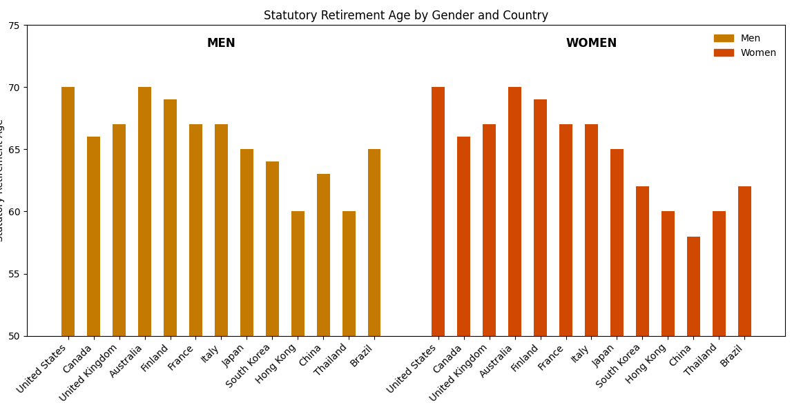

# The Rules

## Retirement Age as an Institutional Constraint

1. Retirement age as a formal rule, not an individual choice

Retirement age refers to the age at which workers are required—or permitted—to exit the formal labor force[1]. Across countries, retirement systems vary in design. Some jurisdictions define retirement age as a minimum eligibility threshold, allowing individuals to continue working beyond that point. Others, including China, implement mandatory retirement, requiring workers to exit formal employment at a fixed age.

This distinction matters. Mandatory retirement transforms retirement age from a personal or financial decision into an institutional constraint that shapes career length, promotion horizons, and organizational talent planning.

2. The gender-differentiated retirement rule in China

China’s modern retirement policy framework was largely established in the late 1970s. According to the Provisional Regulations of the State Council on the Retirement and Resignation of Workers (GF No. 104 [1978]):
- Male employees retire at age 60
- Female workers retire at age 50
- Female cadres retire at age 55

These rules apply broadly across enterprise employment and remain a defining feature of China’s labor system. Unlike eligibility-based systems, these age limits function as hard exit points, irrespective of individual health status, performance, or organizational demand.

From a structural perspective, this creates gender-differentiated career horizons embedded directly in policy.

3. International context: retirement age is not universally gendered

Globally, retirement age policies exhibit substantial variation. Many OECD countries have gradually equalized retirement ages between men and women, often linking retirement thresholds to life expectancy or pension sustainability rather than gender.

A comparative overview of retirement age policies illustrates that China’s gender-differentiated approach is not the global norm, particularly among economies that rely heavily on skilled labor and late-career leadership.

Figure 1 illustrates how statutory retirement rules define different expected career horizons for men and women across selected economies. The comparison focuses on institutional design rather than individual choice

4. Policy design logic: why retirement age exists
Retirement age policies are typically designed with multiple objectives in mind, including Managing labor supply, Containing pension and fiscal costs, Accounting for health and life expectancy, Reflecting occupational demands.

In many jurisdictions, increases in life expectancy have been used as a justification to gradually raise retirement ages in the 21st century. Importantly, these considerations are macro-level and largely gender-neutral in intent.

However, when a gender-differentiated rule is applied uniformly across occupations and career stages, it may interact with labor market structures in unintended ways.

5. Early signals of tension within the rule
Empirical research and survey evidence suggest that the gendered retirement rule in China has long generated mixed responses.

A 2011 Research Report on the Retirement Age Issue in China [2] found that more than half of female respondents—across both worker and cadre categories—viewed the existing policy as inadequate. Reported concerns included:
- Constraints on career development
- Loss of accumulated experience
- Reduced lifetime income
- Mismatch between capability and exit timing

International literature further indicates that women tend to retire earlier than men across a range of contexts, influenced by factors such as caregiving responsibilities, marital status, and spousal income (Harris & Fasbender, 2025[3]). While these patterns are often discussed as preference-based, they also interact strongly with institutional exit rules.

6. Why this rule matters for organizational outcomes
From an organizational perspective, retirement age is often treated as an external constraint beyond managerial control. Yet its effects are not neutral.

Research on workplace gender representation shows that women remain underrepresented at senior levels across sectors, even when entry-level participation is strong (McKinsey, Women in the Workplace 2025). When combined with a shorter mandatory career horizon, gender-differentiated retirement age mechanically reduces the time available for:
- Late-career promotions
- Leadership accumulation
- Return on organizational investment in talent development

At this stage, no causal claim is required. The rule alone establishes asymmetric time constraints that shape downstream outcomes.

7. Where formal rules meet informal adaptation

Despite its rigidity, the retirement age rule is not applied uniformly in practice.

Evidence suggests that organizations frequently make exceptions at senior or scarce-talent levels, allowing selected individuals—often regardless of gender—to remain in leadership roles beyond statutory limits. At the individual level, practices such as “formal retirement with continued work” (退而不休) have become common responses to the same constraint.

These adaptations indicate that while the rule is fixed on paper, its consequences are actively negotiated in reality—often in ways that introduce inconsistency and hidden cost.

## (Transition to Part II)
Taken together, retirement age in China functions not merely as a labor policy, but as a structural rule that shapes career horizons before individual or organizational decisions are even made.

The next section examines how this rule interacts with promotion timing, leadership accumulation, and incentive structures to produce systematic effects across stakeholders.

[1][中华人民共和国退休制度](https://zh.wikipedia.org/wiki/%E4%B8%AD%E5%8D%8E%E4%BA%BA%E6%B0%91%E5%85%B1%E5%92%8C%E5%9B%BD%E9%80%80%E4%BC%91%E5%88%B6%E5%BA%A6?utm_source)
[2] 刘伯红, 郭砾, & 郝蕊. (2011). 退休年龄问题研究报告. 中国妇女: 英文月刊, (5), 50-53.
[3] Harris, A., & Fasbender, U. (2025). Gender differences in retirement decisions and outcomes: a systematic literature review and recommendations for future research. Work, Aging and Retirement, waaf011.
[4] [Women in the workpalce 2025](https://www.mckinsey.com/capabilities/people-and-organizational-performance/our-insights/women-in-the-workplace#/)

