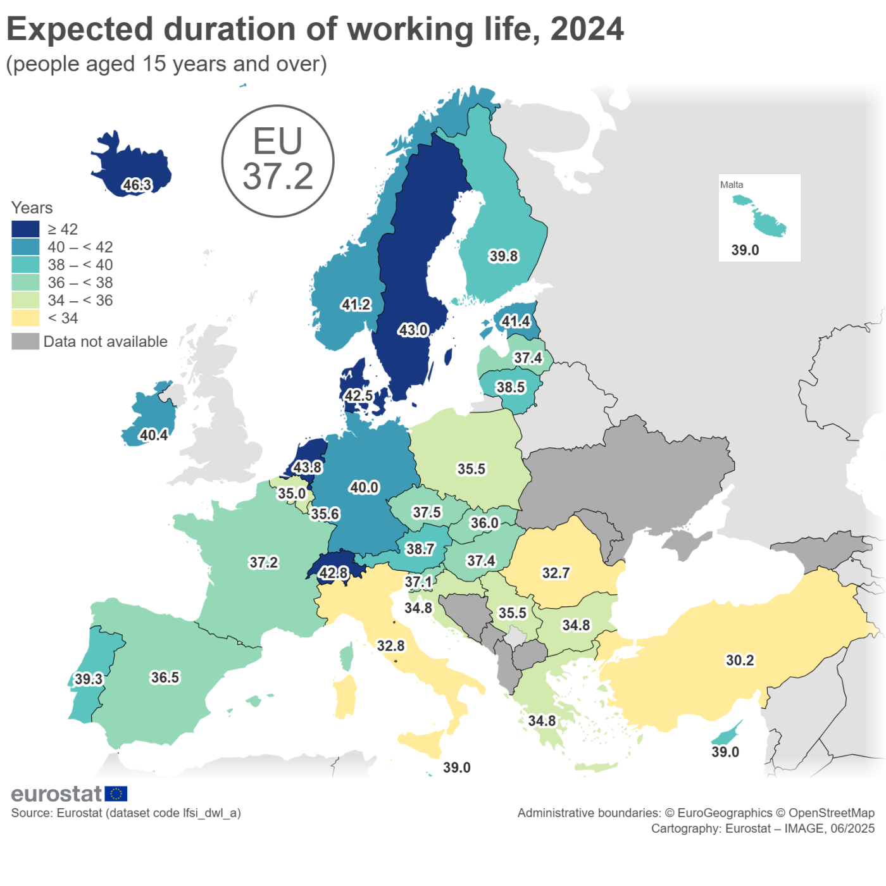

# The Mechanism

## How Retirement Age Shapes Career Outcomes Through Time
### Overview: from rule to mechanism

The retirement age rule does not directly determine who is promoted or who becomes a leader. Instead, it operates through a time-based mechanism: by shortening or extending expected career horizons, it alters how promotion systems, investment decisions, and individual strategies unfold over time.

This section examines three linked mechanisms:
1. Career horizon compression
2. Promotion timing and leadership accumulation
3. Rational adaptation under constraint

Together, they explain how a neutral-looking rule generates asymmetric outcomes without requiring explicit discrimination.

⸻

### 2.1 Career Horizon Compression

Career horizon refers to the expected number of remaining working years available to an individual at any point in their career. Mandatory retirement rules define this horizon ex ante.

Empirical context: expected working life

In the European Union, the average expected duration of working life in 2024 was 37.2 years, with a clear gender gap:
- Men: 39.2 years
- Women: 35.0 years
- Gender gap: 4.2 years

Over the past decade, expected working life has increased across most EU countries, reflecting longevity gains and delayed labor market exit. However, the gender gap persists and varies substantially across countries. Finland recorded one of the smallest gaps (0.6 years), while Italy exhibited one of the largest (9.0 years).

Figure 2 illustrates the cross-country variation in expected working life in Europe. 
From: https://ec.europa.eu/eurostat/statistics-explained/index.php?title=Duration_of_working_life_-_statistics

Interpretation:
Even in eligibility-based retirement systems, gendered differences in career duration remain. In mandatory retirement systems, these differences are formalized and intensified.

⸻

Interaction with life-course factors

Career horizons do not operate in isolation. They interact with:
- Caregiving responsibilities
- Marital and spousal income arrangements
- Health trajectories

These factors tend to cluster earlier in women’s careers, amplifying the effect of an earlier exit rule. The result is not a single “career interruption,” but a cumulative shortening of investable time.

⸻

### 2.2 Promotion Timing and Leadership Accumulation

Promotion systems are inherently time-dependent. Promotions are not evenly distributed across a career; returns to leadership roles are back-loaded.

Classic labor economics research has established that promotion is a primary channel through which long-run compensation and authority accumulate (Lazear, 1992; Gibbs, 1996).

Typical promotion cycles

Evidence[5] from the United States suggests that:
*Average time to promotion across major corporations is approximately 30 months*

Promotion speed varies by industry:
- Technology: 1–3 years
- Manufacturing and traditional industries: 3–5 years
- Promotion intervals lengthen with seniority:
- Entry → Associate: ~9 months
- Associate → Mid-level: 18–24 months
- Mid-level → Senior: 2–3 years
- Senior → Vice President: ~22 months on average

Leadership roles therefore require both time and continuity.

The China case: long ladders, late returns

In China, particularly within public-sector and large state-affiliated organizations, promotion ladders are long. Reaching senior leadership often requires 30 years or more of continuous progression, with intense filtering at each stage.

Under such conditions, a five-year difference in mandatory retirement age does not merely reduce total tenure; it can eliminate entire promotion windows, especially at the senior stage where leadership capital is accumulated.

**Key insight**:
Shorter career horizons disproportionately affect late-stage advancement, even when early-career entry rates are equal.

⸻

### 2.3 Rational Adaptation Under Constraint

When formal rules constrain outcomes, individuals and organizations adapt rationally.

Individual responses: “retire but not exit” (退而不休)

In China, retirement age and pension eligibility coincide. This creates strong financial incentives to retire formally while continuing to work informally.

Survey evidence indicates:
- 28.7% of respondents intended to continue paid work after retirement
- Among female workers, the figure was 28.4%

For female cadres, retiring five years earlier than male counterparts can result in an estimated 168,500 yuan reduction in lifetime earnings (assuming constant wages). Under such conditions, continued post-retirement work becomes a rational strategy rather than a preference.

Importantly, early retirement does not necessarily imply withdrawal from the labor market; it often reflects reclassification, not exit.

⸻

Organizational responses: selective exceptions

Organizations also adapt:
- Senior leaders and scarce talent are often retained beyond statutory retirement age
- Exceptions are negotiated informally, unevenly, and often opaquely

While these practices preserve organizational capacity, they introduce:
- Inconsistency in rule application
- Greater reliance on discretion
- Reduced transparency in advancement norms

Over time, such exceptions can undermine the predictability that formal rules were designed to provide.

⸻

### (Transition to Part III)

The mechanisms outlined above demonstrate that retirement age functions as a structural filter rather than a personal choice. The next section examines how these mechanisms translate into distributional outcomes across individuals, organizations, and policy systems—and what trade-offs decision-makers face when considering reform.

[5] [The State of Career Longevity in 2025: A Comprehensive Research Report](https://blog.theinterviewguys.com/the-state-of-career-longevity-in-2025/)
