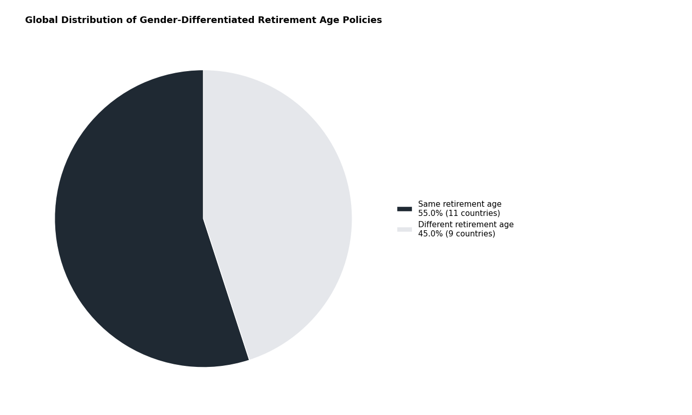
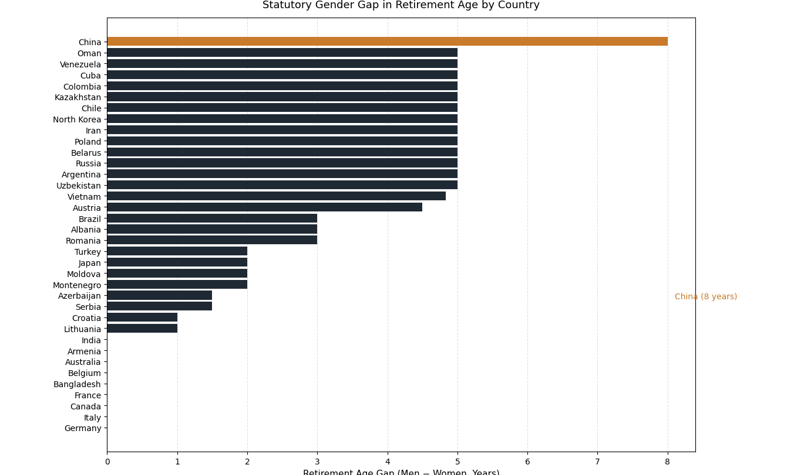
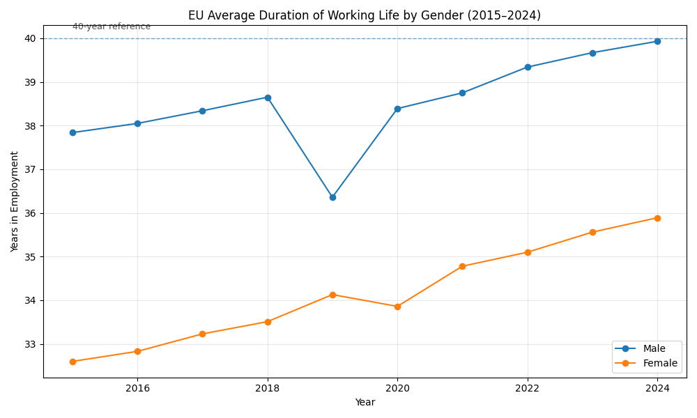
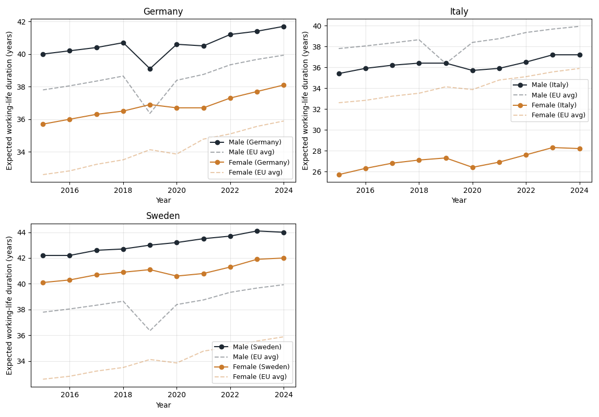
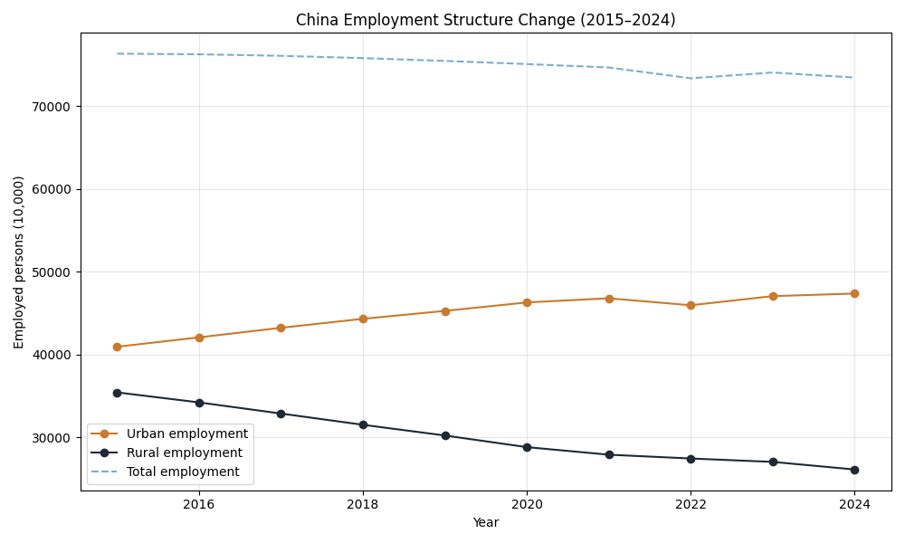

# Data and Evidence

## 4.1 Data Sources and Indicator Definition

The expected duration of working life data are drawn from Eurostat’s [lfsi_dwl_a](https://ec.europa.eu/eurostat/databrowser/view/lfsi_dwl_a__custom_19619047/default/table) dataset, which estimates the average number of years a person aged 15 is expected to remain in the labour force, based on current labour force participation rates and life expectancy.

The Labor force participation rate data come from [World Bank](https://data.worldbank.org/indicator/SL.TLF.CACT.ZS)
Number of Employeed Person use stastistics result from [National Bureau of Statistics of China](https://data.stats.gov.cn/english/easyquery.htm?cn=C01)

These indicator provides a consistent, comparable measure across countries and genders, making it suitable for illustrating how structural policy constraints—such as retirement age—translate into realized differences in career horizons over the life course.	

## 4.2 Pie chart — global policy structure

Across the sampled countries, a majority have equalized statutory retirement ages for men and women. However, a substantial minority continue to differentiate retirement age by gender, indicating that retirement age remains an active and contested policy lever rather than a universally settled norm.

## 4.3 Horizontal bar chart — gap magnitude (China focus)

Among countries that maintain gender-differentiated statutory retirement ages, China exhibits the largest gap—approximately eight years between men and women. This places China at the extreme end of the global distribution, making it a particularly informative case for examining how retirement rules shape gendered career horizons.

## 4.4 EU working-life duration — time series (core mechanism evidence)

Both male and female expected working-life durations increase steadily over time, reflecting systematic policy and labor-market adjustments in response to population ageing.

The visible dip around 2019–2020—particularly among men—coincides with COVID-related labor market disruptions, while the subsequent rebound suggests institutional resilience rather than permanent contraction.

Importantly, although the gender gap persists, both genders experience parallel extensions of working life, indicating that longer career horizons are not a zero-sum outcome between men and women.

## 4.5 Three-country comparison — structural accumulation

Germany shows a gradual extension of working life with a moderate and relatively stable gender gap, consistent with incremental labor-market reform.

Italy exhibits a persistent and substantial gender gap—often approaching a decade—reflecting cumulative structural barriers to female labor participation across the life course, even as overall working-life duration increases.

Sweden combines long expected working lives with near gender convergence, illustrating how early-career participation, family policy, and retirement rules jointly shape realized career length.

These patterns suggest that convergence in statutory retirement age alone is insufficient; realized equality reflects the accumulation of structural conditions over time.

  (consider to add EU average as thin dash line in three plots)

## 4.6 Transition to China

### Zoom in China
EU evidence suggests that extending working life—even in the presence of persistent gender gaps—does not mechanically reduce employment opportunities. This raises a relevant question for China, where demographic ageing, declining total employment, and a large statutory retirement-age gap coexist.

## 4.7 China employment structure (urban vs rural)

While total employment in China has gradually declined over the past decade, urban employment continues to expand, offset by a sharp contraction in rural employment.

This divergence reflects structural transformation rather than cyclical unemployment, suggesting that extending female labor participation would more likely reshape sectoral composition than exacerbate aggregate job scarcity.
